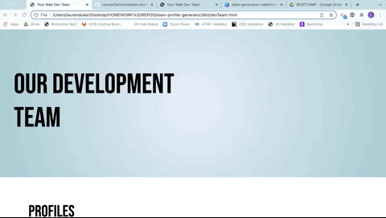

# Dev Team Profile Generator
## Lauren Darrimon
    
    
### Description
Automatically generate a development team page in HTML through a command line application. REspond to simple prompts and recive back a fully formed HTML page with all of your team members information. 

### Table of Contents

* [Link](#link)
* [Installation](#installation)
* [Usage](#usage)
* [Contributing](#contributing)
* [Questions](#questions)
* [License](#license)

### Link 
🔗 
Link to application [Dev Team Profile Generator](https://github.com/LaurenDarrimon/team-profile-generator)

### Installation
🔧
In order for this application to work, you need to install the following (dependencies): 
node.js and modules: jest, fs, and inquirer. 

~~~
npm install
~~~

### Usage 
To run the application from the command line: 

~~~
node index.js
~~~

Respond to the user prompts in the command line. Once you are done, download the distribution folder for a complete and styled webpage. [See a full walkthrough video here.](https://drive.google.com/file/d/18vdxYxEn3_g9X2H9Zh5EesJ3hu8Uy-VG/view?usp=sharing) 

### Testing

To run the tests of the application from the command line: 

~~~
npm run test
~~~

### Contributing 
✍️ 
Lauren Darrimon is the author of this application. Find additional work on Lauren Darrimon's [Github profile.](http://github.com/laurenDarrimon).

### Questions
❓💌
Reach out to Lauren Darrimon at hello@laurenlalita.com if you have any questions. 

### License
The license for this project is: [MIT](https://opensource.org/licenses/MIT)

